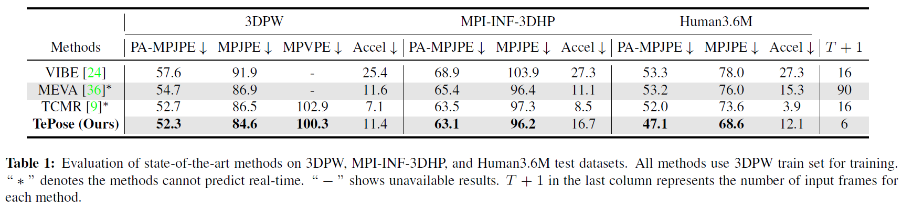
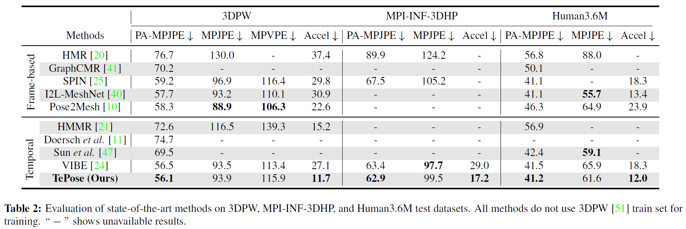

# Live Stream Temporally Embedded 3D Human Body Pose and Shape Estimation

Contact: 

[Zhouping Wang](wang.zhoup@northeastern.edu)

[Sarah Ostadabbas](ostadabbas@ece.neu.edu)

## Introduction
This repository is the official PyTorch implementation of [Live Stream Temporally Embedded 3D Human Body Pose and Shape Estimation]. 
The base codes are largely borrowed from [TCMR](https://github.com/hongsukchoi/TCMR_RELEASE).

## Installation
TePose is developed using python 3.7 on Ubuntu 18.04.
You may need sudo privilege for the installation.
```bash
source scripts/install_pip.sh
```

## Demo
- Download the pretrained SMPL layers from [here](https://smpl.is.tue.mpg.de) (male&female), [here](http://smplify.is.tue.mpg.de) (neutral) and SMPL regressor. Put SMPL layers (pkl files) under `${ROOT}/data/base_data/`. These opeartions can be realized with follwing code
```bash
source scripts/get_base_data.sh
```
- Download pre-trained [TePose weights](https://drive.google.com/drive/folders/14FcyVy49ryBH1AuVKgBXDNqjZsi-tivY?usp=sharing). 


- Run demo with options (e.g. render on plain background). See more option details in bottom lines of `demo.py`.
- A video overlayed with rendered meshes will be saved in `${ROOT}/output/demo_output/`. 
```bash
python demo.py --vid_file merged_courtyard_basketball_01.mp4 --gpu 0 
```


## Running TePose

Pre-processed PoseTrack, 3DPW, MPI-INF-3DHP and Human3.6M are uploaded by TCMR authors from [here](https://drive.google.com/drive/folders/1h0FxBGLqsxNvUL0J43WkTxp7WgYIBLy-?usp=sharing).
Pre-processed InstaVariety is uploaded by VIBE authors [here](https://owncloud.tuebingen.mpg.de/index.php/s/MKLnHtPjwn24y9C).
AMASS can be generated following the instruction provided by VIBE authors [here](https://github.com/mkocabas/VIBE/blob/master/doc/train.md).
Download pseudo SMPL labels from [here](https://drive.google.com/drive/folders/1iLTMYMVo_BwRu3P-LpM_Bp1O6_e-xPh6?usp=sharing). You could also generate it by yourself with following code
```bash
source scripts/prepare_pseudo_thetas.sh
```

The data directory structure should follow the below hierarchy.
```
${ROOT}  
|-- data  
|   |-- base_data  
|   |   ├── J_regressor_extra.npy
|   |   :
|   |   └── spin_model_checkpoint.pth.tar
|   |-- preprocessed_data  
|   |   ├── 3dpw_test_all_db.pt
|   |   ├── 3dpw_test_all_pseudotheta.pt
|   |   :
|   |   ├── posetrack_train_db.pt
|   |   └── posetrack_train_pseudotheta.pt
|   |-- pretrained_models
|   |   ├── tepose_wopw_3dpw_test.pth.tar
|   |   :
|   |   └── tepose_wpw_mpii3d_h36m_test.pth.tar
|-- demo.py
:
:
|-- merged_courtyard_basketball_01.mp4
```

### Evaluation

- Run the evaluation code with a corresponding config file to get performance in different settings. You could also check the visual performance by adding "--render" at the end of the command.
```bash
# dataset: 3dpw, mpii3d, h36m 
python evaluate.py --dataset 3dpw --cfg ./configs/repr_wpw_3dpw_model.yaml --gpu 0 
python evaluate.py --dataset 3dpw --cfg ./configs/repr_wopw_3dpw_model.yaml --gpu 0 
python evaluate.py --dataset h36m --cfg ./configs/repr_wpw_h36m_mpii3d_model.yaml --gpu 0 
python evaluate.py --dataset h36m --cfg ./configs/repr_wopw_h36m_model.yaml --gpu 0 
python evaluate.py --dataset mpii3d --cfg ./configs/repr_wpw_h36m_mpii3d_model.yaml --gpu 0 
python evaluate.py --dataset mpii3d --cfg ./configs/repr_wopw_mpii3d_model.yaml --gpu 0 
```
- You may test options such as average filtering and rendering. See the bottom lines of `${ROOT}/lib/core/config.py`.

## Results
We compare proposed TePose with state-of-the-art methods in the following tables.




### Reproduction (Training)

- TePose models with different settings can be trained with different configuration file. For example, training model without 3DPW as train set for evaluating on 3DPW test set (results of 4 columns on the right of first table) can be realized by the first command as follows

```bash
# training outputs are saved in `experiments` directory
# mkdir experiments
python train.py --cfg ./configs/repr_wpw_3dpw_model.yaml --gpu 0 
python train.py --cfg ./configs/repr_wpw_h36m_mpii3d_model.yaml --gpu 0 
python train.py --cfg ./configs/repr_wopw_3dpw_model.yaml --gpu 0 
python train.py --cfg ./configs/repr_wopw_h36m_model.yaml --gpu 0
python train.py --cfg ./configs/repr_wopw_mpii3d_model.yaml --gpu 0  
```
- After the training, the checkpoints are saved in `${ROOT}/experiments/{date_of_training}/`. Change the config file's `TRAIN.PRETRAINED` with the checkpoint path (either `checkpoint.pth.tar` or `model_best.pth.tar`) and follow the evaluation command.


## Reference
```
@inproceedings{wang2022tepose,
  title={Live Stream Temporally Embedded 3D Human Body Pose and Shape Estimation},
  author={Wang, Zhouping and Ostadabbas, Sarah},
  booktitle={arXiv preprint: https://arxiv.org/pdf/2207.12537.pdf},
  month     = {July},
  year      = {2022}
}
```

## License
* This code is for non-commercial purpose only. 
* For further inquiry please contact: Augmented Cognition Lab at Northeastern University: http://www.northeastern.edu/ostadabbas/ 


